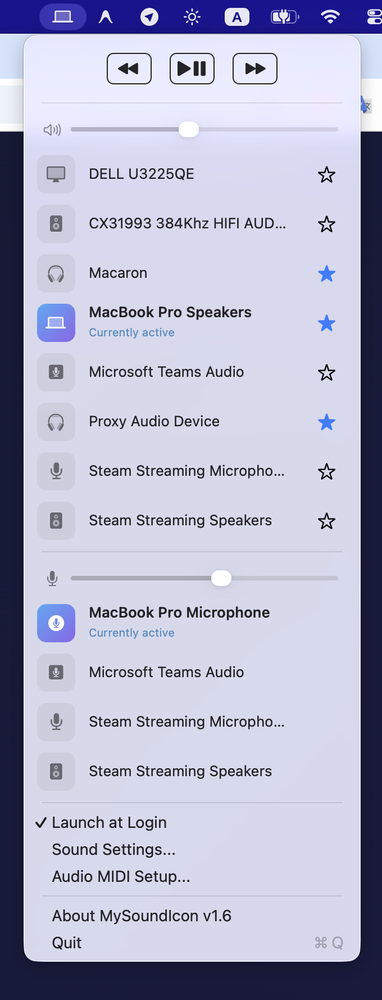
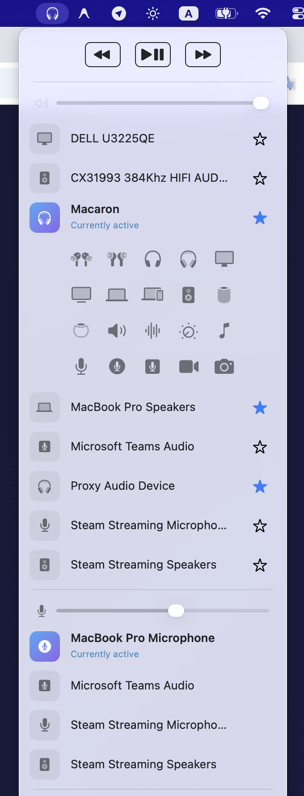
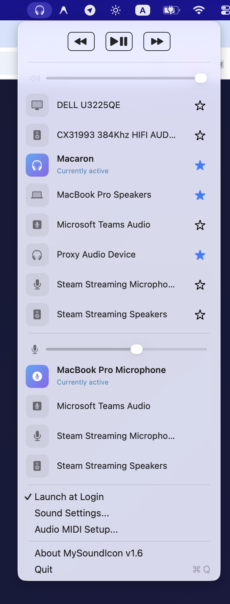
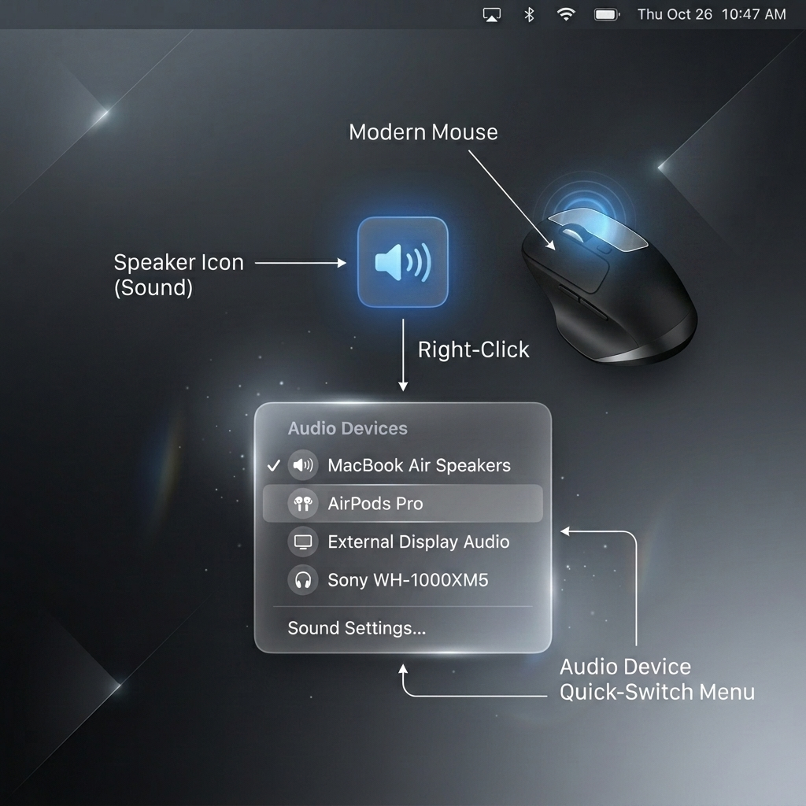
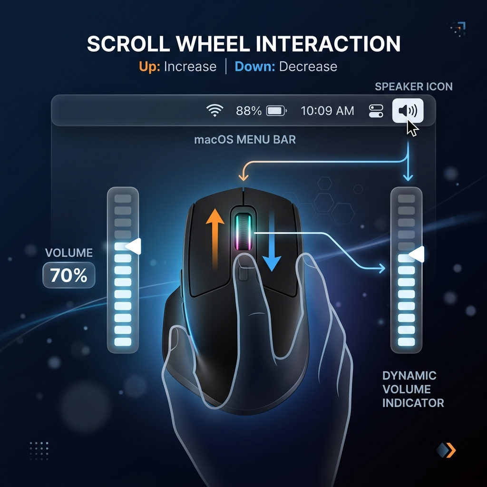
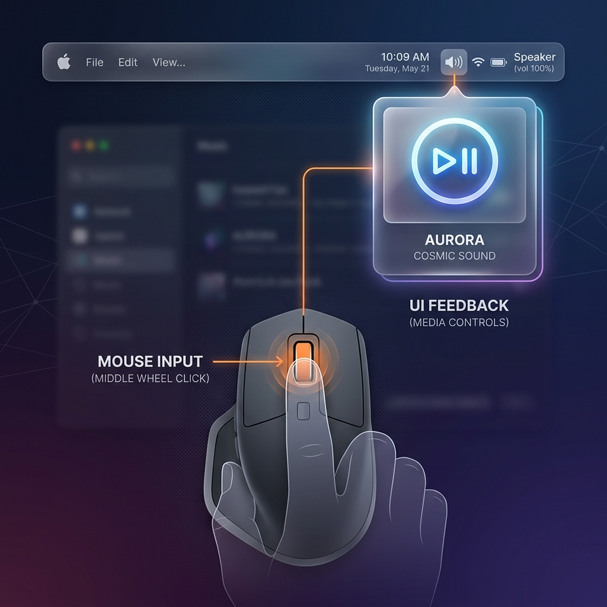

  
  
  <h1>My Sound Icon</h1>
  
<b>Take Control of Your Sound Devices</b>

  
Easily manage input and output audio devices, change icons, intercept
                    media keys, volume controls with a beautiful UI

  
  <a href="https://github.com/foobnix/mysoundicon.com/releases"><b>Download for macOS</b></a>

---

## Overview

| Choose output | Customizable icon | Star device |
|:---:|:---:|:---:|
|  |  |  |
| Quickly switch between your favorite output devices | Choose icon for your output device | Quickly switch between your favorite audio devices by right click |

| Right Click                                                                       | Mouse Wheel                                                         | Middle Click                                                                  |
| :---------------------------------------------------------------------------------:| :-------------------------------------------------------------------:| :-----------------------------------------------------------------------------:|
|                         |                |                   |
| Quickly cycle through your starred audio output devices without opening the menu. | Change volume instantly by scrolling up or down over the tray icon. | Play or pause your current media with a simple middle click on the tray icon. |

---

## Features

- **Smart Quick-Switch**: Star your favorite headphones and speakers. Simply right-click the tray icon to instantly cycle through them without opening a menu.
- **Customizable Icons**: Assign unique Apple SF Symbols to every audio device you own so you can recognize your active output at a glance.
- **Built-in Media Controls**: Play, pause, and skip tracks seamlessly straight from your menu bar using native macOS media event integration.

---

  &copy; 2026 Ivan Ivanenko. Built for macOS. 
  Contact: <a href="mailto:ivan.ivanenko@gmail.com">ivan.ivanenko@gmail.com</a>

